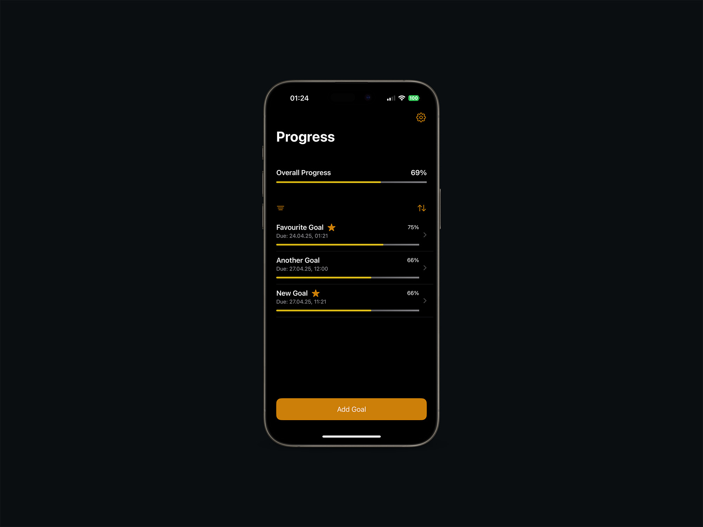
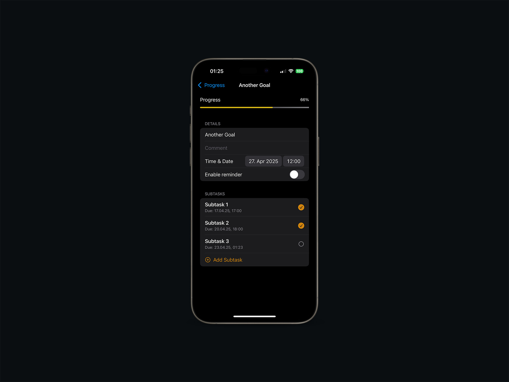
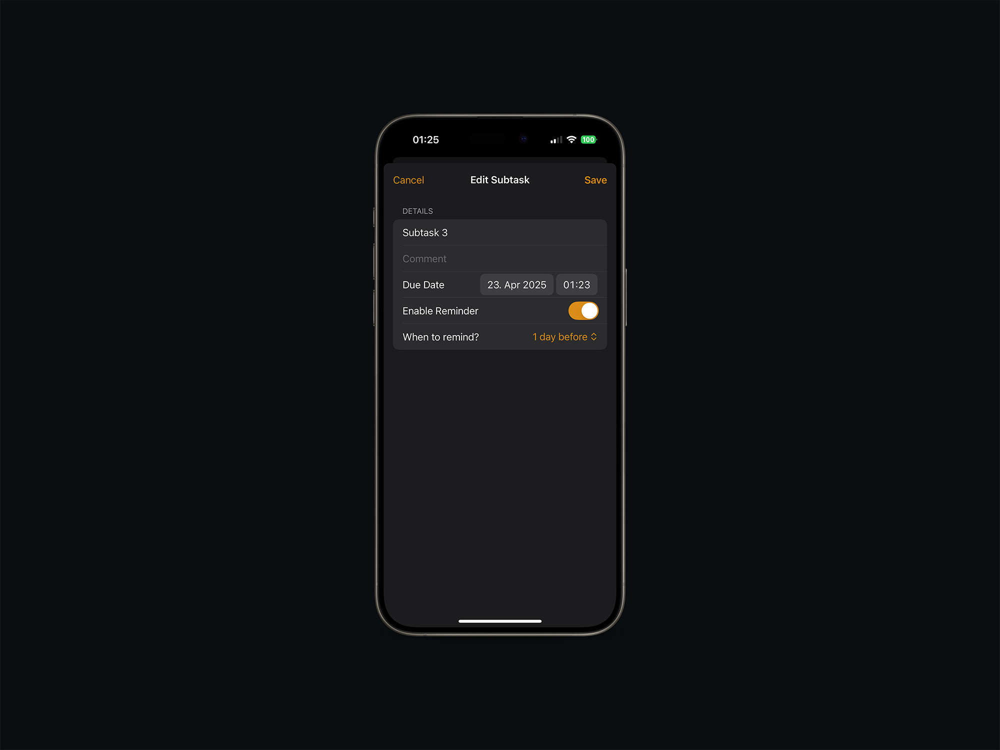
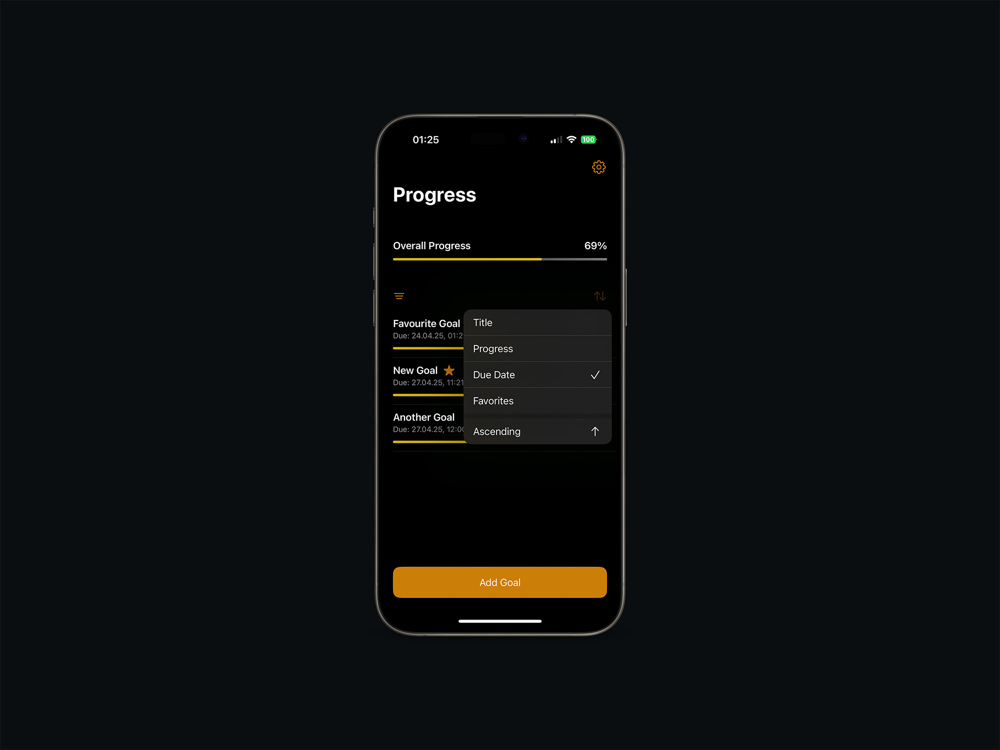
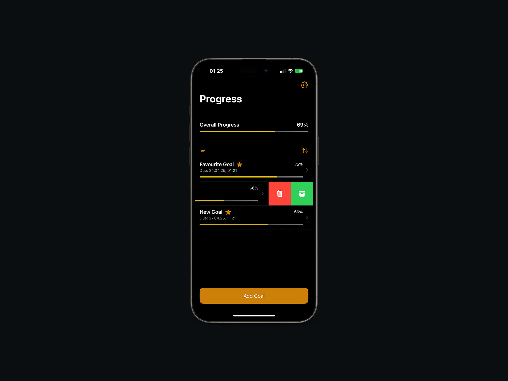
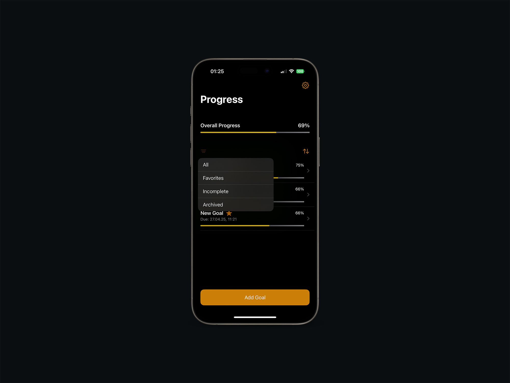
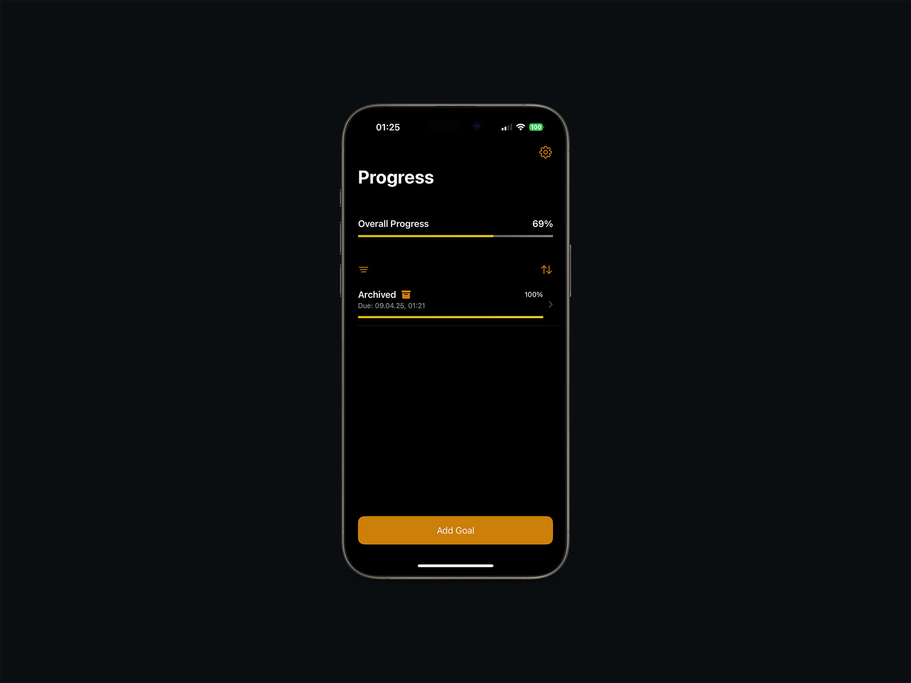
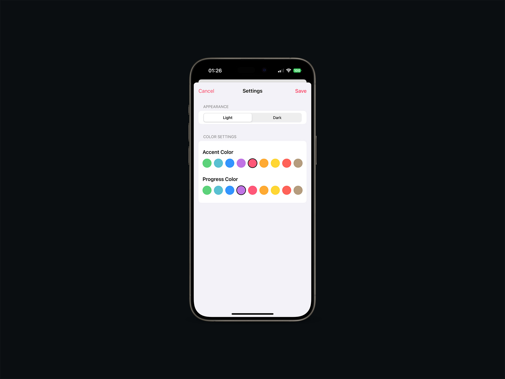
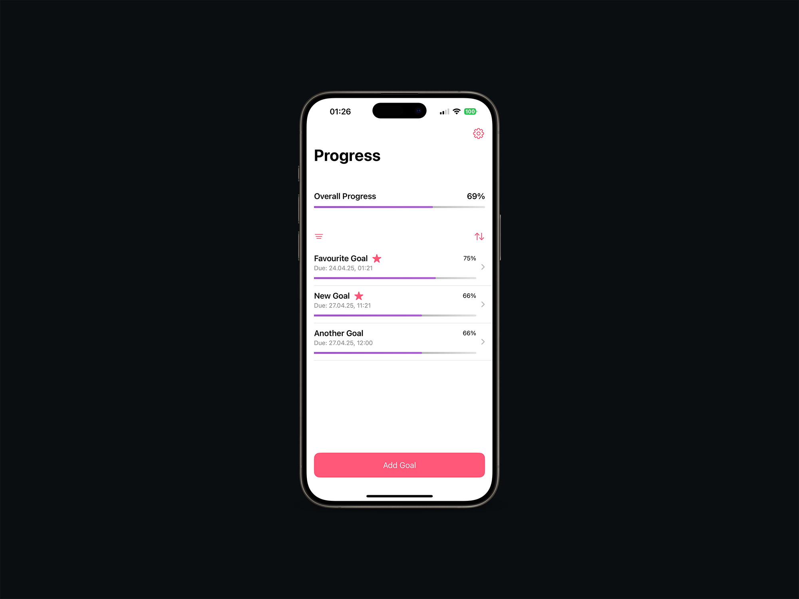

# Progress App

A task and goal tracking app built with SwiftUI that helps users track their progress on various goals and subtasks.

## Features

- Create, edit, and delete goals with subtasks
- Track progress with visual progress bars
- Mark goals as favorites for quick access
- Archive completed goals
- Sort and filter goals by various criteria
- Dark and light mode support
- Customizable colors for UI elements
- Set reminders for goals and subtasks

## Screenshots

## Requirements

- iOS 16.0+
- Xcode 15.0+
- Swift 5.9+

## Installation

1. Clone the repository
2. Open Progress.xcodeproj in Xcode
3. Build and run the application

## Future Improvements

- SwiftData integration for more robust data persistence
- Advanced Design or UI/UX
- Goal categories and tags
